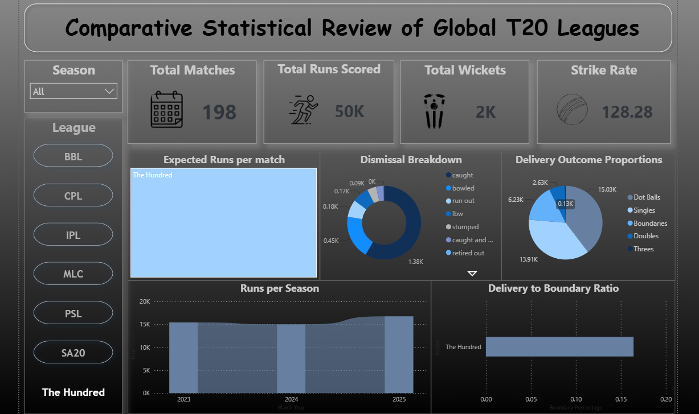

# Comparative Statistical Review of Global T20 Leagues (2023–2026)

## Project Overview
This project presents an interactive Power BI dashboard comparing performance and gameplay dynamics across seven major global T20/short-format franchise leagues: **IPL, PSL, BBL, MLC, SA20, CPL, and The Hundred**. 

The goal is to analyze scoring velocity, boundary tendencies, delivery distributions, and dismissal patterns across different global playing conditions on a normalized timeline.

---

## Data Architecture & ETL Pipeline
* **Source:** Granular delivery-by-delivery data sourced from [Cricsheet](https://cricsheet.org/matches/).
* **Timeframe Normalization (2023+):** The dataset is scoped from the 2023 season onwards to ensure fair comparability, as leagues like **SA20** and **Major League Cricket (MLC)** debuted in 2023.
* **Data Processing (Python):** Sourced raw nested JSON match files, extracted delivery attributes, cleaned anomalies, and consolidated them into two relational CSV files for Power BI ingestion.
* **Data Modeling & DAX:** Custom Data Analysis Expressions (DAX) were engineered for metrics including:
  * `Strike Rate` (Runs per 100 legal balls)
  * `Delivery to Boundary Ratio` (Boundary balls / Total legal balls)
  * `Expected Runs per Match`
  * `Dismissal Segmentation & Proportion Analysis`

---

## Cross-League Comparison

| League | Matches | Total Runs | Total Wickets | Strike Rate | Boundary % | Primary Characteristic |
| :--- | :---: | :---: | :---: | :---: | :---: | :--- |
| **IPL** | 293 | 106K | 4K | **150.24** | **~20.5%** | Global leader in scoring velocity and boundary density |
| **PSL** | 143 | 49K | 2K | **142.26** | **~19.0%** | Second highest boundary rate and aggression |
| **MLC** | 105 | 34K | 1K | **136.69** | **~17.5%** | High boundary intent in compact playing venues |
| **CPL** | 98 | 31K | 1K | **133.13** | **~16.5%** | Spin-dominant and variable scoring environments |
| **BBL** | 165 | 51K | 2K | **132.73** | **~15.5%** | Vast boundary sizes; highest reliance on running 2s |
| **SA20** | 130 | 39K | 2K | **130.63** | **~16.0%** | Seam-friendly; lower scoring rates |
| **The Hundred** | 198 | 50K | 2K | **128.28** | **~16.5%** | Lowest aggregate strike rate across short formats |

---

## Key Findings & Visual Insights

* **Subcontinent Power-Hitting Dominance:** The **IPL (150.24 SR)** and **PSL (142.26 SR)** lead all tournaments in boundary scoring frequency (~19–20.5% of balls bowled), driven by high batting depth and true-bounce tracks.
* **Venue Dimensions Dictate Running Strategy:** The **BBL** generated over 3.1K doubles compared to 5.9K boundaries (~52% ratio), while the **IPL** produced 4K doubles compared to 14K boundaries (~28% ratio), illustrating how Australian ground sizes reward outfield placement over boundary-hunting.
* **Bowling Control in SA20 & The Hundred:** SA20 and The Hundred recorded the highest dot-ball proportions relative to singles, highlighting more bowler-dominant conditions.
* **Dismissal Consistency:** Caught dismissals represent 65–70% of all wickets across all tournaments, with Bowled holding second place (~20%), showing uniform risk-taking behavior in the shortest format globally.

---

## Repository Contents
* `t20.pbix`: Complete Power BI Report file with visuals, themes, and DAX measures.
* `T20-Leagues-Dataset.zip`: The cleaned and consolidated datasets used to power the dashboard (compressed due to file size limits). Extract this folder to access the raw CSV files.
* `images/`: Folder containing high-resolution screenshots of the main dashboard and league-specific filters.
